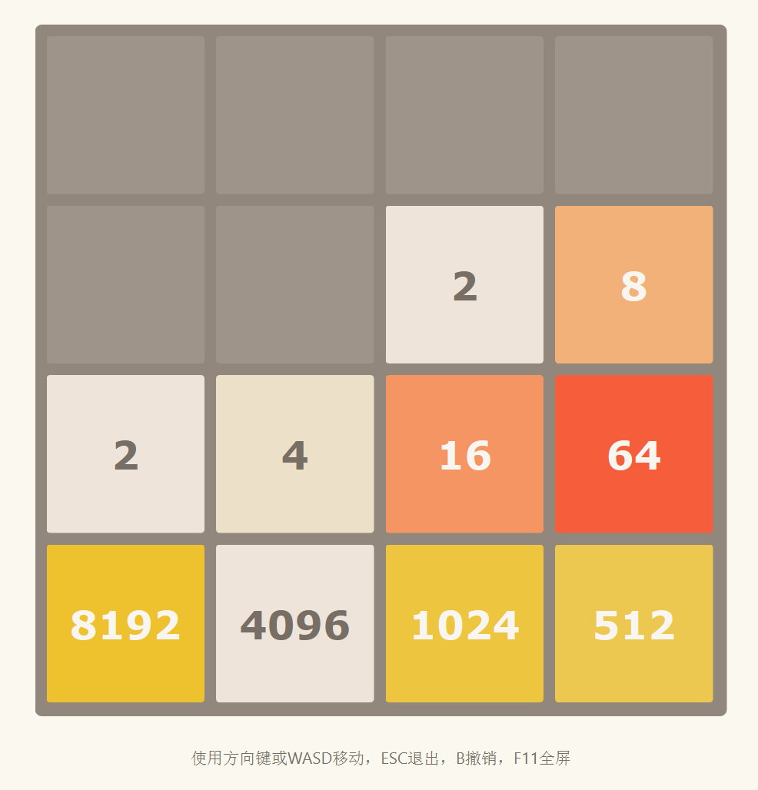

2048 Python (AI Enhanced Version)
===================================

[](https://repl.it/github/yangshun/2048-python)

---

**🤖 NEW: AI Enhanced Version Available!**

This project now includes an AI-enhanced version that integrates with Ollama to allow large language models to play 2048 autonomously, with comprehensive game statistics and performance tracking.

---

Based on the popular game [2048](https://github.com/gabrielecirulli/2048) by Gabriele Cirulli. The game's objective is to slide numbered tiles on a grid to combine them to create a tile with the number 2048. This version uses PySide6 for a modern, responsive interface and includes AI capabilities!



## 🚀 Quick Start

### AI Enhanced Version (Recommended)
```bash
# Easy launch with dependency checking
python start_ai_game.py

# Or use the batch file on Windows
start_ai_game.bat
```

### Original Version
```bash
# GUI version (standalone)
python game.py

# Console version
python console_game.py
```

## Features

### 🤖 AI Features (New!)
- **Ollama Integration**: Connect any local Ollama model to play 2048
- **Model Selection**: Choose from available models in your Ollama installation
- **AI vs Human Comparison**: Track performance differences between AI and human players
- **Configurable AI Speed**: Adjust move delay from 0.5 to 10 seconds
- **Live AI Status**: See what the AI is thinking in real-time
- **Game Statistics**: Comprehensive tracking of all games with export capability

### GUI版本特性
- **Modern PySide6 Interface**: Enhanced visual experience with Qt framework
- **Fullscreen Support**: Press F11 to toggle fullscreen mode
- **Responsive Layout**: Game board maintains square aspect ratio and scales with window size
- **Undo Function**: Press 'B' to undo the last move
- **Real-time Statistics**: Live score, move count, elapsed time display
- **Multiple Control Schemes**: 
  - Arrow keys (↑↓←→)
  - WASD keys
  - Alternative IJKL keys

### 控制台版本特性
- **Cross-platform Terminal Support**: Works on Windows PowerShell, Linux bash, and macOS terminal
- **Colorful Interface**: ANSI color codes for enhanced visual experience
- **Real-time Score Display**: Shows current score and move count
- **Interactive Help System**: Press 'H' for in-game help
- **Restart Function**: Quick game restart with 'R' key
- **Unicode Characters**: Beautiful box-drawing characters for game board
- **Responsive Display**: Automatically clears screen for smooth gameplay

## Installation

### Basic Installation
First, install the required dependencies:

    $ pip install -r requirements.txt

### Ollama Setup (For AI Features)
1. **Install Ollama**: Visit [ollama.ai](https://ollama.ai) and download Ollama for your platform
2. **Start Ollama**: Run `ollama serve` in terminal
3. **Install Models**: Download models like:
   ```bash
   ollama pull llama2
   ollama pull mistral
   ollama pull codellama
   ```
4. **Verify Installation**: Run `ollama list` to see installed models

## Running the Game

### GUI版本 (PySide6)

要启动图形界面版本，运行：
    
    $ python game.py

或使用原始的分离文件版本：

    $ python puzzle.py

### 控制台版本

要启动控制台版本，可以使用以下方式：

**直接运行：**
    
    $ python console_game.py

**Windows (PowerShell/CMD)：**
    
    $ start_console.bat

**Linux/macOS (Bash)：**
    
    $ ./start_console.sh

**或使用Python启动脚本：**
    
    $ python start_console.py

## Controls

### AI Enhanced Version
- **Movement**: Arrow keys, WASD, or IJKL to move tiles (human mode)
- **AI Control**: Click "Start AI" to let AI play, "Stop AI" to resume manual control
- **Model Selection**: Choose different Ollama models to compare AI strategies
- **Statistics**: Click "Statistics" to view comprehensive game data
- **New Game**: Click "New Game" button to restart
- **Undo**: Press 'B' to undo the last move (human mode only)
- **Fullscreen**: Press 'F11' to toggle fullscreen mode
- **Quit**: Press 'Escape' to exit the game

### GUI版本控制
- **Movement**: Use arrow keys, WASD, or IJKL to move tiles
- **Undo**: Press 'B' to undo the last move  
- **Fullscreen**: Press 'F11' to toggle fullscreen mode
- **Quit**: Press 'Escape' to exit the game

### 控制台版本控制
- **Movement**: Use arrow keys or WASD to move tiles
- **Restart**: Press 'R' to restart the game
- **Help**: Press 'H' to show help information
- **Quit**: Press 'Q' or 'Escape' to exit the game

## Requirements

### GUI版本
- Python 3.6+
- PySide6 6.5.0+

### 控制台版本
- Python 3.6+
- 支持ANSI颜色代码的终端 (大多数现代终端都支持)
- Windows: PowerShell, Command Prompt, Windows Terminal
- Linux/macOS: Bash, Zsh, 或任何兼容终端

Contributors:
==

- [Yanghun Tay](http://github.com/yangshun) - Original tkinter version
- [Emmanuel Goh](http://github.com/emman27) - Original tkinter version
- PySide6 modernization and enhancements
